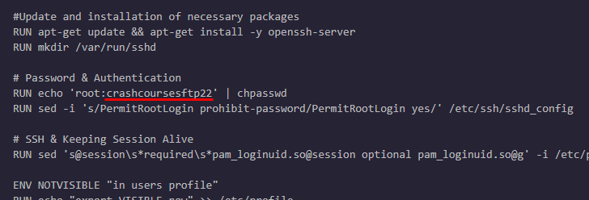
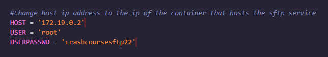

# DevOps Crash course
## Git Laboratory - Scripting and Programming

 

### SSH Node
El archivo necesario para la creación del contenedor que aloja el servicio de SFTP se encuentra en la carpeta 📁 **node-sftp**. En su interior se creó un script bash llamado 📄deploy-sftp.sh:

Para la configuración del contendor que aloja el servicio de SFTP se debe tener en cuenta lo siguiente:

- El puerto por el que se expone el servicio es configurable mediante la variable containerport, por favor asegurarse que el puerto a utilizar este libre en el host:

- Para este despliegue de sftp de demostración se utiliza el usuario root, por lo que en la configuración debe configurarse una contraseña personalizada.

---
 

### Client Node
Los archivos necesarios para la creación del contenedor que aloja el cliente que se conectará al servicio SFTP se encuentra en la carpeta 📁 **node-client**. En su interior se creó un script bash llamado 📄deploy-client.sh, un archivo de configuración de crontab del usuario 📄root y un script de python que realiza la conexión a SFTP y la gestión de log 📄connectionsftp

Para la configuración de la conexión al servicio SFTP se debe tener en cuenta lo siguiente:

- La conexión al servicio se realiza por defecto cada diez minutos (configuración crontab)

- Es necesario configurar en el script de python connectionsftp la dirección ip del contenedor que aloja el servicio de SFTP, así como las credenciales del usuario que se conectará:

- La gestión de logs se está realizando mediante el módulo de python paramiko en un archivo nombrado 📄connsftp.log

---

### Homework by [Jose Alcaraz](https://github.com/JoseAlcarazA "Jose Alcaraz")

---
 

---
Footer
© 2022 GitHub, Inc.
Footer navigation
Terms
Privacy
Security
Stat