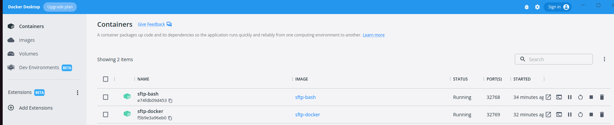
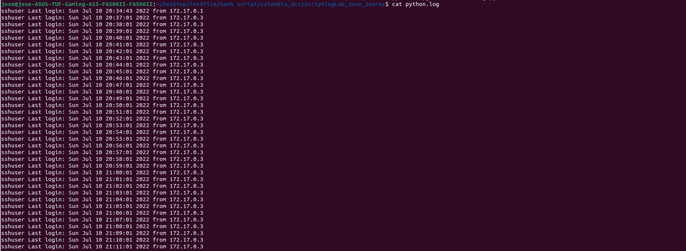

# Laboratorio de Bash Scripting y Python
 ## Ejecución:

1. Desde la línea de comandos, ejecutar el siguiente comando:

    bash ./sftp_bash.sh

De esta manera ejecutaremos el código contenido en el archivo **sftp_bash.sh** para ejecutar un contenedor llamado sftp-bash.  Es importante ejecutar el comando **exit** para cerrar sesión en el servidor sftp.

2. Para instanciar el contenedor que ejecuta la conexión al servidor sftp cada 10 minutos mediante crontab, ejecutar los siguientes comandos:

    * docker build -t sftp-docker -f Dockerfile.dockers .

    * docker run -d -p 32769:22 --name sftp-docker sftp-docker

Los anteriores comandos generan el segundo contenedor llamado **sftp-docker**.  Podemos verificar la ejecución de ambos contenedores observando Docker Desktop:

3. La ejecución del programa en Python que crea un nuevo archivo de log, debemos ejecutar este comando:

    python3 ./getInfofromCronLog.py

se creará un archivo llamado **python.log**, el cual podremos visualizar ejecutando el comando **cat python.log** (esta imagen muestra conexiones cada minuto solo para demostración, el cron job programado realiza conexiones cada 10 minutos).

